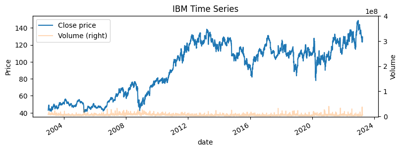
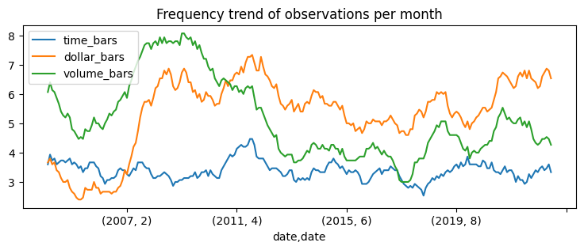
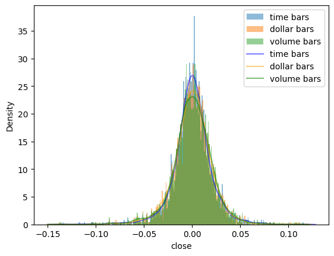
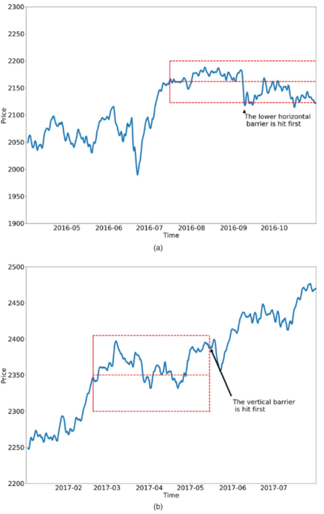
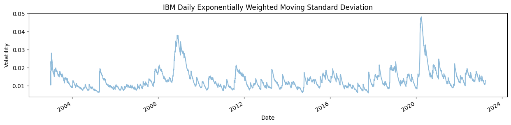
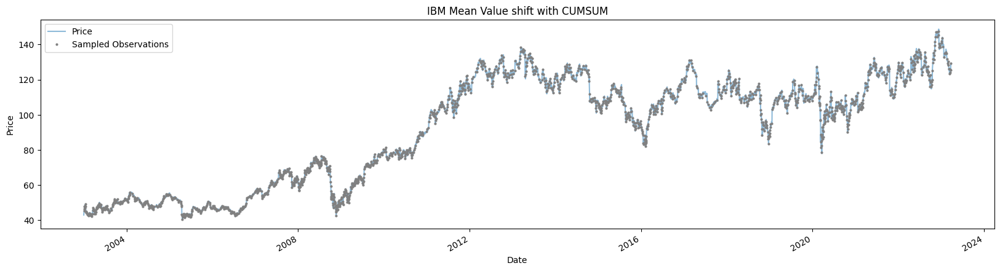

This part of the project documentation focuses on a **learning-oriented** approach.
You'll get started with the code in this project.

# <center> Finance Machine Learning: Meta-Labeling Application </center>

<center> **Renan Delgado Camurça Lima**

June 30 2023 <br>
renandcl@ita.br <br> </center>

## Introduction

### Overview

In this material you will find a brief introduction to the Meta-Labeling application.
By the end of this tutorial, you will be able to:

- Execute a feature engineering and comprehend chronologically sampling the time series.

- Apply labeling techniques with Bollinger Bands, MADC and Triple Barrier Method.

- Understand the Meta-Labeling application and its advantages.

This example can be reproduced in the juptyer notebook [meta_labeling_tutorial](
    \tutorial\meta_labeling_tutorial.ipynb).

### Context

Recent researches started to use artificial intelligence and machine learning
techniques in asset pricing and market trend forecasting to increase investment
profitability [[1]](#1). Nevertheless, the use of machine learning techniques in
 financial markets is still a challenge, due to variables complexity and noise
 signals, and strategies have been developed to deal with this problem, such as
  the use of labeling techniques, which are used to identify the trading
  opportunities in the data [[2]](#2).

In addition to the labeling techniques, the use of meta-labeling techniques is
also a powerful to improve the performance of machine learning models.
Meta-labeling is a technique that uses the output of a primary model to generate
a new label for the data, which is used to train a secondary model [[3]](#3).
This technique seeks to maximize the model's recall (capturing correctly all positive
trading opportunities) as well as its precision (minimizing the false positive
rate)[[4]](#4).

### Objective

This work aims to analyze the chronological sampling statistical characteristics, the
performance of some labeling techniques in the stock market, and investigate the
potential benefit of meta-learning techniques when combined with these techniques.

## Feature Engineering

Feature engineering is the process of transforming raw data into features that
better represent the underlying problem to the predictive models, resulting in
improved model accuracy on unseen data. On financial markets, the data is usually
time series that represent the price stock and aggregated into bars which
represents its volatility on a given period of time.

Although the labeling techniques aggregate information to the data, some pitfall can
occur depending on the technique on chronological sampling [[3]](#3). Normally, the
time bars are, nonetheless, market do don process information at a constant
interval [[4]](#4).

Moreover, time bars generally exhibit poor statistical properties. To mitigate it,
it can be applied some other strategy, as volume and dollar bars, which tend to
exhibit more stable sampling and its returns are more normally distributed [[5]](#5).

On this analysis, it will be used the following features:

- **Close**: The adjusted closing price of the stock.
- **Volume**: The number of shares traded in a day.
- **Label**: Labels generated by the labeling techniques long or short positions.


### Time Series Data

The data used in this example is from a company listed on the US stock market. On
this exploratory process, IBM stocks has been selected for data comprehensions purpose.

```python
>>> import pandas as pd
>>> data = pd.read_csv(f"../../data/data.csv")
>>> data.head()
	open	low	high	close	adj_close	volume	shares_outstanding
date
2002-12-31	73.71	73.71	75.01	74.09	42.94	8233484	    1.804664e+09
2003-01-02	75.33	74.75	77.03	77.03	44.64	8226267	    1.804664e+09
2003-01-03	77.15	76.68	78.06	78.06	45.24	6236566	    1.804664e+09
2003-01-06	78.30	78.21	81.07	79.91	46.32	8285680	    1.804664e+09
2003-01-07	80.26	80.07	82.39	82.22	47.65	12454617	1.804664e+09
```

Plotting the time series for the adjusted close values and volume traded:

```python
>>> import matplotlib.pyplot as plt  # noqa: E402
>>> import numpy as np  # noqa: E402
>>> plt.figure(figsize=(9, 3))
>>> data["adj_close"].plot(
...     legend=True,
...     title="IBM Time Series",
...     xlabel="Date",
...     ylabel="Price",
...     label="Close price",
... )
>>>
>>> data["volume"].plot(
...     secondary_y=True,
...     alpha=0.3,
...     yticks=np.arange(0, 5e8, 1e8),
...     legend=True,
...     label="Volume",
...     ylabel="Volume",
...     )
>>> plt.show()
```



### Chronological Sampling

The aggregation on bars have some advantages, such as the reduction of the noise on
the data, and the reduction of the computational cost. However, it can also have
some disadvantages, such as the loss of information, and the loss of the
chronological order [[5]](#5).

Therefore, it will be performed a comparison between on common aggregation
technique, the time bars, volume bars and the dollar bars.

#### Bars Aggregation

```python
>>> from fico.chronologicalsampling import dollar_bars, time_bars, volume_bars
>>> data["date"] = pd.to_datetime(data["date"])
>>> data = data.set_index("date")
>>> close = data["adj_close"]
>>> volume = data["volume"]
>>> time_bars_ohlc = time_bars(close, time_range="3d")
>>> dollar_bars_ohlc = dollar_bars(volume, close, dollar_amount=1e9)
>>> volume_bars_ohlc = volume_bars(volume, close, traded_volume=1.2e7)
>>> volume_bars_ohlc.tail()
             close                            volume
              open    high     low   close    volume
date
2023-03-14  124.65  124.65  124.65  124.65   8103883
2023-03-15  123.28  124.70  123.28  124.70  12387764
2023-03-17  123.69  123.69  123.69  123.69  37339906
2023-03-20  125.94  126.57  124.05  124.05  11928331
2023-03-23  123.37  129.31  123.37  129.31  14951189
```

The volume bars are generated by counting the number of shares traded in a given
time interval. The dollar bars are generated by counting the total dollar amount
of shares traded in a given dollar quantity. The time bars are generated by
observations in a given time interval.

The aggregation on bars have some advantages, such as the reduction of the noise
on the data, and the reduction of the computational cost. However, it can also
have some disadvantages, such as the loss of information, and the loss of the
chronological order. For evaluating the noise reduction, the volatility of the
data will be evaluated.

#### Frequency Trend Plot

```python
>>> time_bars_price = time_bars_ohlc.loc[:, "close"]
>>> time_bars_ret = np.log(time_bars_price.close / time_bars_price.close.shift(1)).dropna()
>>> dollar_bars_price = dollar_bars_ohlc.loc[:, "close"]
>>> dollar_bars_ret = np.log(
...     dollar_bars_price.close / dollar_bars_price.close.shift(1)).dropna()
>>>
>>> volume_bars_price = volume_bars_ohlc.loc[:, "close"]
>>> volume_bars_ret = np.log(
...     volume_bars_price.close / volume_bars_price.close.shift(1)).dropna()
>>>
>>> info_freq = pd.DataFrame(
...     index=data.index,
...     data={
...         "time_bars": time_bars_ret,
...         "dollar_bars": dollar_bars_ret,
...         "volume_bars": volume_bars_ret,
...         },
...     )
>>>
>>> info_freq = (info_freq > 0).astype(int)
>>> info_freq.groupby([info_freq.index.year, info_freq.index.month],
...     ).agg("sum").rolling(15).mean(
...     ).plot(figsize=(9, 3),title="Trend frequency of observations per month")
>>> plt.show()
```


The previous plot shows the aggregated data on months for each aggregation technique.
An observation on these plots are that the volume bars vary more than the other bars,
nonetheless, the dollar bars tend to follow the volume bars. This could be more
investigated, however, it could mean a value change on stock price following the
trend of volume change.

On the following plot, the volatility of the data is evaluated. The volatility is
calculated by the standard deviation of the returns of the data. The returns are
calculated by the difference between the actual adjusted close values from previous
adjusted close values.

#### Density Plot

```python
>>> import seaborn as sns
>>> bin_len = 0.001
>>> plt.hist(
...     time_bars_ret,
...     bins=np.arange(min(time_bars_ret), max(time_bars_ret) + bin_len, bin_len),
...     label="time bars",
...     alpha=0.5,
...     density=True,
...     )
>>> plt.hist(
...     dollar_bars_ret,
...     bins=np.arange(min(dollar_bars_ret), max(dollar_bars_ret) + bin_len, bin_len),
...     label="dollar bars",
...     alpha=0.5,
...     density=True,
...     )
>>> plt.hist(
...     volume_bars_ret,
...     bins=np.arange(min(volume_bars_ret), max(volume_bars_ret) + bin_len, bin_len),
...     label="volume bars",
...     alpha=0.5,
...     density=True,
...     )
>>>
>>> sns.kdeplot(time_bars_ret, label="time bars", color="blue", alpha=0.5)
>>> sns.kdeplot(dollar_bars_ret, label="dollar bars", color="orange", alpha=0.5)
>>> sns.kdeplot(volume_bars_ret, label="volume bars", color="green", alpha=0.5)
>>> plt.legend()
>>> plt.show()
```



On the plot, it is observed a long tail on the volatility of the data, which is
characteristic of the financial market. Moreover, it is not observed a significant
difference between the volatility of the data, which means that the aggregation
techniques do not affect the volatility of the data for the IBM stocks. Further
investigation should be performed to evaluate, due to the given results are not
conclusive and differs from the expected results. For this reason, time bars will
be used for the following analysis.


### Labeling

Labeling is the process of assigning a label to each observation in the data.
In this tutorial, it will be used the following labeling techniques:

- **Triple Barrier Method**: The Triple Barrier Method technique generates labels
based on the price of the stock and the volatility of the stock.
- **Bollinger Bands**: The Bollinger Bands technique generates labels based on
the price of the stock and the Bollinger Bands.
- **MADC**: The MADC technique generates labels based on the price of the stock
and the MADC.

#### Triple Barrier Method (TBM)

Labeling in Finance generally labels observation using the fixed-time horizon
method [[5]](#5).

However, this method is not suitable for all cases, due to the fact of time bars
not exhibiting good statistical properties

An approach to mitigate this problem is the triple barrier labeling, which is a
method that labels observations based on the first barrier reached.

For the fixed horizontal method, considers $X$ as a feature matrix with $m$ rows,
${X_i}_{i=1,\cdots,m}$, drawn from some bars with index $t=1,\cdots,T$, where
$m \leq T$. The triple barrier method labels the $i$-th observation as $y_i$
according to the following rule:

$$
    y_{i} = \begin{cases}
        1 & \text{if } {R_{{t}_{i,0},{t}_{i,0+h}}} > v \\
        0 & \text{if } \vert {R_{{t}_{i,0},{t}_{i,0+h}}} \vert \leq v \\
        -1 & \text{if } {R_{{t}_{i,0},{t}_{i,0+h}}} < -v
  \end{cases}
$$

where $R_{{t}_{i,0},{t}_{i,0+h}}$ is the return from the observation $i$, which
$R_{{t}_{i,0},{t}_{i,0+h}} = \frac{P_{t_{i,0+h}}-P_{t_{i,0}}}{P_{t_{i,0}}}$,
where $P_{t_{i,0}}$ is the price at time $t_{i,0}$, and $v$ is the predefined
threshold constant.

In figure (a), it can be seen that the lower horizontal barrier is first reached, a $-1$
value is returned. In figure (b) the path never reaches the horizontal and triggers
a $0$ label when the vertical barrier is reached [[6]](#6).

{width=75%}

To implement the TBM, the following steps are performed:

- Compute the dynamic thresholds for the upper and lower barriers.

- Determine a signal/trigger for initializing the TBM.

- Add vertical barriers based on trigger times.

- Determine the time of the first touch for each trigger.

- Apply the labels for side and size of the bet.

##### **Determining Daily Volatility**

The first step to implement the TBM is to determine the daily volatility of the
data. The daily volatility is calculated by the standard deviation of the exponential
weighted moving average of the returns of the data.

For this evaluation, it has been considered a span of 50 days.

```python
>>> stock_df = pd.DataFrame({"close": close})
>>> span0 = 50
>>> daily_vol = np.log(stock_df.close).diff().dropna().ewm(span=span0).std()
```

Plotting the daily volatility, it can be seen that the volatility
is not constant over time.

```python
>>> pd.DataFrame(daily_vol).plot(
...     figsize=(15, 3),
...     title="IBM Daily Exponentially Weighted Moving Standard Deviation",
...     xlabel="Date",
...     ylabel="Volatility",
...     alpha=0.5,
...     legend=False,
... )
>>> plt.show()
```



##### **Determine a signal/trigger for initializing the TBM**

The second step is to determine a signal/trigger for initializing the TBM. An approach
is the Symmetric CUSUM Filter, which detects a shift in the mean value of a measured
quantity away from a target value [[7]](#7). It do not considers a fixed time range,
but instead, it considers a dynamic shift in the mean value over a target threashold as
a trigger. For example, if the average volatility is 1%, once exceeds a 1% net
change since last event, it would generate a new event and reset the
filter [[7]](#7).

For this evaluation, it has been considered as threshold the mean value of exponential
weighted return.

```python
>>> from fico.triplebarriers import get_t_events
>>> threshold = daily_vol.mean() * 1
>>> cusum_events = get_t_events(stock_df.close, threshold=threshold)
```

Plotting the cusum events, it can be seen that the events are triggered when the
volatility exceeds the threshold.

```python
>>> stock_df.close.plot(
...     figsize=(20, 5),
...     legend=True,
...     title="IBM Mean Value shift with CUMSUM",
...     xlabel="Date",
...     ylabel="Price",
...     label="Price",
...     alpha=0.5,
... )
>>>
>>> plt.plot(
...     stock_df.close.loc[cusum_events].index,
...     stock_df.close[cusum_events],
...     "o",
...     markersize=2,
...     color="grey",
...     label="Sampled Observations",
... )
>>>
>>> plt.legend()
>>> plt.show()
```



##### **Add vertical barriers based on trigger times**

The third step is to add vertical barriers based on trigger times. The vertical
barriers considers a given time range after the trigger time.

For this evaluation, the cusum events are considered as triggers witha a time
range of 5 days.

```python
>>> from fico.triplebarriers import add_vertical_barrier
>>> vertical_barriers = add_vertical_barrier(t_events=cusum_events, close=close, num_days=5)
>>> vertical_barriers
2003-01-03   2003-01-08
2003-01-06   2003-01-13
2003-01-07   2003-01-13
2003-01-08   2003-01-13
2003-01-09   2003-01-14
                ...
2023-03-07   2023-03-13
2023-03-09   2023-03-14
2023-03-15   2023-03-20
2023-03-20   2023-03-27
2023-03-22   2023-03-27
Name: date, Length: 1744, dtype: datetime64[ns]
```

##### **Determine the time of the first touch for each trigger**

The fourth step is to determine the time of the first touch for each trigger, in
which, the action would be profit taking or stop loss on the first touch of the
triple barrier. The output of this step is a dataframe with the time of the first
touch and the target volatility.

```python
>>> from fico.triplebarriers import get_events
>>> pt_sl = np.array([1, 2])  # setting profit-take and stop-loss at 1 and 2 std
>>> min_ret = 0.0005  # setting a minimum return of 0.05%
>>> triple_barrier_events = get_events(
...     close=stock_df.close,
...     t_events=cusum_events,
...     pt_sl=pt_sl,
...     target=daily_vol,
...     min_ret=min_ret,
...     vertical_barriers=vertical_barriers,
... )
>>>
>>> triple_barrier_events
                   t1      trgt
2003-01-03 2003-01-06  0.018014
2003-01-06 2003-01-07  0.012677
2003-01-07 2003-01-08  0.010379
2003-01-08 2003-01-09  0.023456
2003-01-09 2003-01-14  0.022007
...               ...       ...
2023-03-15 2023-03-16  0.010597
2023-03-20 2023-03-22  0.011161
2023-03-22 2023-03-27  0.011400
2023-03-24 2023-03-27  0.011514
2023-03-27        NaT  0.013037

[1746 rows x 2 columns]
```

##### **Apply the labels for side and size of the bet**

With the events of the triple barrier, it can be applied the labels for side and size
of the bet. The side of the bet is the direction of the bet, which can be long,
short or neutral as signals 1, -1 and 0, respectively. The size of the bet can be
considered the return of on the first touch of the triple barrier, which can be
considered as the profit taking or stop loss.


```python
>>> from fico.triplebarriers import get_bins
>>> labels = get_bins(triple_barrier_events, stock_df.close)
>>> labels.bin.value_counts()
bin
 1.0    942
-1.0    801
 0.0      2
Name: count, dtype: int64
>>> labels.head()
                 ret  bin
2003-01-03  0.023873  1.0
2003-01-06  0.028713  1.0
2003-01-07 -0.020986 -1.0
2003-01-08  0.033441  1.0
2003-01-09  0.018046  1.0
```

### Bolliinger Bands Strategy

The Bollinger Bands strategy is a mean-reversion strategy that uses the
Bollinger Bands indicator to generate signals. The Bollinger Bands indicator
consists of a middle SMA line and two outer bands, which are the standard
deviation of the SMA. The strategy is based on the assumption that the price
will return to the mean, which is the middle SMA line. The strategy is
implemented as follows:

* **Entry rule**: Long when the price touches the lower band and short when
the price touches the upper band.
* **Exit rule**: Exit the position when the price touches the middle SMA line.

### Trend Following Strategy

The trend following strategy concerns the idea of two moving averages, with different
time windows, and when the short moving average crosses the long moving average, it is
a signal to buy, and when the short moving average crosses the long moving average,
it is a signal to sell [[6]](#6).

As example, a slow 200 days moving average and a fast 50 days moving average can be
used. When the fast moving average crosses the slow moving average from below, it
is a signal $(1)$ of buying the position, and when the fast moving average crosses
the slow moving average from above, it is a signal of $(-1)$ of selling the
position [[6]](#6).

## Meta-Labeling

Meta-labeling build a secondary ML model that learns how to use a primary
exogenous model [[5]](#5), in order to accept or reject the bet of the primary
model. Therefore, it can assign the side from other strategies, rather than
just THM, and learn only the size of the bet on this meta-labeling model.

Now the possible values for labels are ${0,1}$, as opposed to the previous feasible
values ${−1,0,1}$. The ML algorithm will be trained to decide whether to take the
bet or pass, a purely binary prediction. When the predicted label is $1$, it can be
used the probability of this secondary prediction to derive the size of the bet,
where the side (sign) of the position has been set by the primary model [[5]](#5).

On the first step, an evaluation on Receiver Operating Characteristic (ROC) curve is
performed to find the best threshold to filter the primary model signals with maximum
acceptable recall. Then, the primary model is trained with the prediction of the
primary model to ensure that the precision of the primary model is maximized and
as consequence maximize the f-1 score.

Moreover, the secondary model could consider exogenous signals, which are signals
that are not related to the primary model, such as the trend following strategy.

## References

<a id="1">[1]</a>
J. Yu, K. Chang, (2020).
Neural Network Predictive Modeling on Dynamic Portfolio Management -
A Simulation-Based Portfolio Optimization Approach.
J. Risk Financial Manag. vol. 13(11), pp. 285.

<a id="2">[2]</a>
Y. Han, J. Kim, D. Enke, (2023)
A machine learning trading system for the stock market based on
N-period Min-Max labeling using XGBoost.
Expert Systems with Applications, v. 211, p. 118581.

<a id="3">[3]</a>
M. Lopez de Prado, (2017).
The 7 reasons most machine learning funds fail (presentation slides).
Social Science Research Network, Rochester, NY, SSRN Scholarly Paper ID, 3197726.

<a id="4">[4]</a>
S. Bounid, M. Oughanem, S. Boukardi, (2022).
Advanced Financial Data Processing and Labeling Methods for Machine Learning.
In: 2022 International Conference on Intelligent Systems and Computer
Vision (ISCV). IEEE. p. 1-6.

<a id="5">[5]</a>
M. Lopez de Prado, (2018).
Advances in financial machine learning. John Wiley & Sons.

<a id="6">[6]</a>
A. Singh, J. Joubert, (2019).
Does meta labeling add to signal efficacy.

<a id="7">[7]</a>
Sefidian, A. M. (2021).
Labeling financial data for Machine Learning. Sefidian Academy.

<!--
\bibitem{b9} P. Nousiainen, Exploration of a trading strategy system based on meta-labeling and hybrid modeling using the SigTechPlatform. 2021. -->
